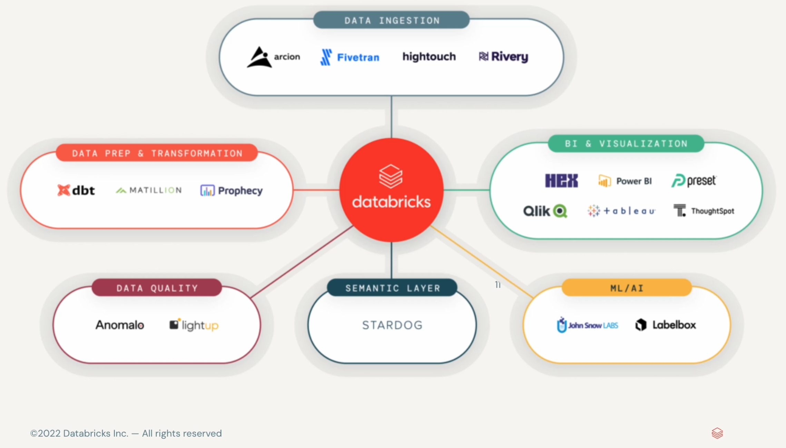

# databricks-data-engineer

Databricks is a lakehouse platform, to perform all the data related jobs into one platform, work efficiently for all type of data into single security governance - data warehousing, data engineering, data streaming, data science and machine learning.

lakehouse = data warehousing + advanced analytics.

Unity catalog - single point of contact for all the governance for data and AI, for all user identity.

Delta Lake - file based open source storage platform that provides data reliability and performance.

Cloud Data Lake - all structured and unstructured data with multiple cloud providers.

This platform is for all data practitioners - Data Engineers, Data Analysts and Machine Learning Practitioners
